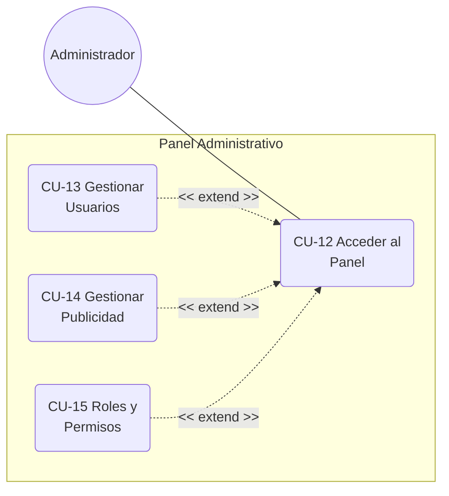

# Gestión Panel Administrativo

```mermaid
graph LR
    %% Actor
    Admin((Administrador))

    %% Sistema
    subgraph "Panel Administrativo"
        UC12(CU-12 Acceder al<br/>Panel)
        UC13(CU-13 Gestionar<br/>Usuarios)
        UC14(CU-14 Gestionar<br/>Publicidad)
        UC15(CU-15 Roles y<br/>Permisos)
    end

    %% Relaciones
    Admin --- UC12

    %% Relaciones Extend (Desde la funcionalidad hacia el acceso base)
    UC13 -.->|<< extend >>| UC12
    UC14 -.->|<< extend >>| UC12
    UC15 -.->|<< extend >>| UC12
```
