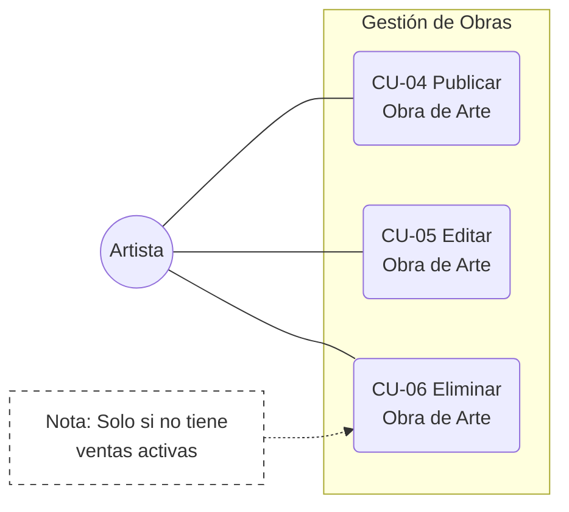

# Gestión de obras

```mermaid
graph LR
    %% Actor
    Artista((Artista))

    %% Sistema
    subgraph "Gestión de Obras"
        UC4(CU-04 Publicar<br/>Obra de Arte)
        UC5(CU-05 Editar<br/>Obra de Arte)
        UC6(CU-06 Eliminar<br/>Obra de Arte)
    end

    %% Relaciones
    Artista --- UC4
    Artista --- UC5
    Artista --- UC6

    %% Nota simulada
    Note1[Nota: Solo si no tiene<br/>ventas activas] -.-> UC6
    style Note1 fill:#fff,stroke:#333,stroke-dasharray: 5 5
```
