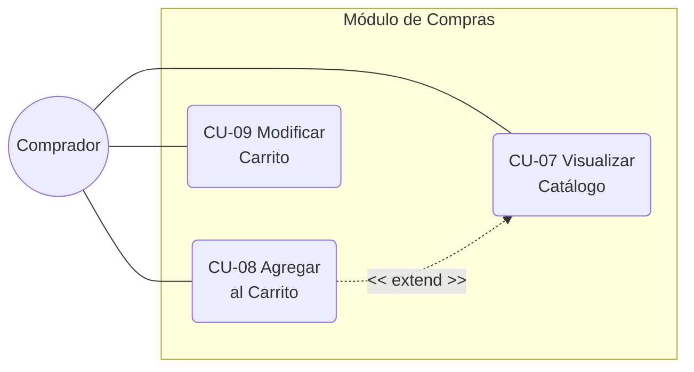

# Módulo de compra

```mermaid
graph LR
    %% Actor
    Comprador((Comprador))

    %% Sistema
    subgraph "Módulo de Compras"
        UC7(CU-07 Visualizar<br/>Catálogo)
        UC8(CU-08 Agregar<br/>al Carrito)
        UC9(CU-09 Modificar<br/>Carrito)
    end

    %% Relaciones
    Comprador --- UC7
    Comprador --- UC8
    Comprador --- UC9

    %% Relación Extend
    UC8 -.->|<< extend >>| UC7
```
