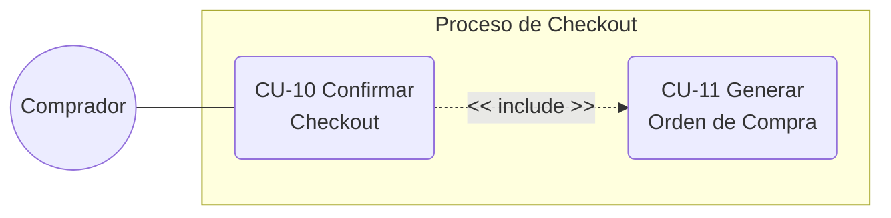

# Proceso de checkout

```mermaid
graph LR
    %% Actor
    Comprador((Comprador))

    %% Sistema
    subgraph "Proceso de Checkout"
        UC10(CU-10 Confirmar<br/>Checkout)
        UC11(CU-11 Generar<br/>Orden de Compra)
    end

    %% Relaciones
    Comprador --- UC10

    %% Relación Include (La orden se genera al confirmar)
    UC10 -.->|<< include >>| UC11
```
