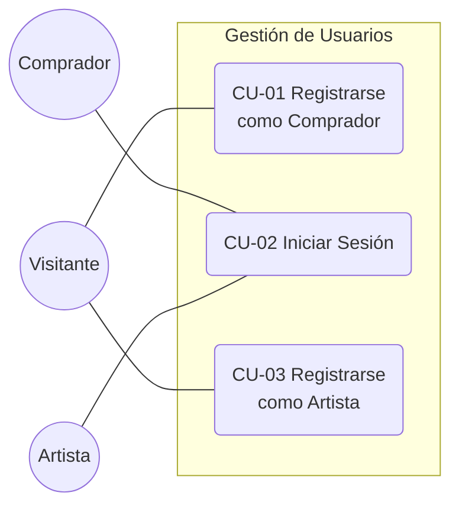

# Gestión de Usuarios

```mermaid
graph LR
    %% Definición de Actores
    Visitante((Visitante))
    Comprador((Comprador))
    Artista((Artista))

    %% Sistema (Límites)
    subgraph "Gestión de Usuarios"
        UC1(CU-01 Registrarse<br/>como Comprador)
        UC2(CU-02 Iniciar Sesión)
        UC3(CU-03 Registrarse<br/>como Artista)
    end

    %% Relaciones
    Visitante --- UC1
    Visitante --- UC3
    Comprador --- UC2
    Artista --- UC2

    %% Estilos para simular la apariencia de UML
    linkStyle default fill:none,stroke:#333,stroke-width:1px;
```
